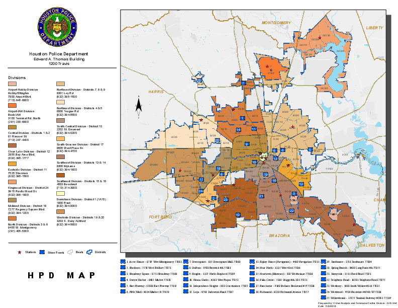

<br /> 

This report follows the predictive analysis of a data set on crime events in Houston, Texas, USA.

This analysis is made by three fundamental tasks: data import and clean-up, data exploratory analysis and predictive modeling. The first task is to import, in an appropriate format R, the data, in order to simplify the analysis thereof, and to perform any data clean-up and/or pre-processing steps, if necessary. The second, in presenting summaries, questions and visualization of the data in ways that will be useful to the police. And in the third task, a prediction task is defined, where a model and its justification are presented, which can help the police answer the question: "What will be the number of events/offenses in police beat X for the period of the day Y?".

**The Problem**

Obtain a model that helps the police to distribute its resources through the different areas of the city (policy beats).

We will assume that the goal of the policy department is to allocate the resources based on the number of estimated events (of any type) for a certain area, i.e., the goal is to accurately estimate the number of events (offenses) that are going to occur on a certain area.

The police makes personel allocation decisions 3 times per day: (i) one decision for the morning period (8:00<= t < 12:00); (ii) one for the afternoon (12:00 <= t < 19:00); and the last decision for the night period (19:00 <= t < 8:00). These decisions are made for each week day and for each police beat.

**The Data**

The provided spreadsheet contains information on crime events on Houston, Texas, USA. Each row contains several information on the event.
<br /> 
<br /> 


#First Task

##Data import and clean-up

###Setting the working directory

Download the file "**crime.xls**" to the directory where you are going to work. Alternatively, if you want to change the current directory, do:

```{r, eval=FALSE}
setwd(dir)
```

And to view the current directory:

```{r}
getwd()
```

###Import the data

**Note:** If you do not have Perl installed on Windows, download it [here](http://www.activestate.com/activeperl/downloads). In other Operative Systems, like Linux Ubuntu, it's usual to have Perl installed.
```{r, eval=FALSE, message=FALSE, warning=FALSE, results='hide'}
#Install the necessary packages
install.packages("gdata")
install.packages("lubridate")
install.packages("xts")
install.packages("dplyr")
install.packages("DMwR")
install.packages("e1071")
install.packages("earth")
install.packages("rpart.plot")
install.packages("performanceEstimation")
```

**Note:** If an error occurred, in Ubuntu, in the installation of the package "earth", run the following command in the Terminal:

```shell
sudo apt-get install liblapack-dev
```

And then, try again:

```{r, eval=FALSE, message=FALSE, warning=FALSE, results='hide'}
install.packages("earth")
```

```{r, message=FALSE, warning=FALSE, results='hide'}
#Load the packages
library(gdata)
library(lubridate)
library(xts)
library(dplyr)
library(stringr)
library(DMwR)
library(class)
library(nnet)
library(e1071)
library(earth)
library(performanceEstimation)
library(DMwR) 
library(rpart.plot)

#The path to "perl.exe"
perldir <- Sys.which("perl")

#Loading the file "crime.xls"
fc <- "crime.xls" 
dat <- read.xls(fc, sheet = 1, header = TRUE, verbose=FALSE, perl=perldir, na.strings = "UNK")

#Dimension of data
dim(dat)

#Names of data
names(dat)

#Structure of data
str(dat)

dat$BlockRange <- as.character(dat$BlockRange)
dat$StreetName <- as.character(dat$StreetName)
dat$Type <- as.character(dat$Type)
dat$Suffix <- as.character(dat$Suffix)
```

###Data clean-up and/or pre-processing steps necessary

The offense types found on the data set are:
```{r}
unique(dat$Offense.Type)
```

We identified an instance where the `Offense.Type` column does not have a valid value. However, it is a registered crime that quite possibly happened, and although it may not help predicting which crimes may occur, it will surely help predicting how many crimes per beat will occur.

```{r}
dat[dat$Offense.Type == 1,]
```

All dates have a valid format:
```{r}
dat[!grep("^[0-9]{4}-[0-9]{2}-[0-9]{2}$", dat$Date),]
```

All hours have a valid format:
```{r}
dat[dat$Hour < 0 | dat$Hour > 23,]
dat[!grep("^[0-9]{2}$", dat$Hour),]
```

Some anomalies (unknown values) were found on the `Beat` column:
```{r}
unique(dat$Beat)
nrow(dat[is.na(dat$Beat),])
```

The `Beat` column is rather important since the purpose of the prediction model is given a beat and a time of the day, predict how many crimes will occur. Luckily, there are not many invalid `Beat` cells.

Some anomalies (unknown values) were found on the `BlockRange` column:
```{r}
nrow(dat[is.na(dat$BlockRange),])
```

Some anomalies (worthless) were found on the `Type` column:
```{r}
unique(dat$Type)
nrow(dat[dat$Type == "-",])
```
Some anomalies (worthless) were found on the `Suffix` column:
```{r}
unique(dat$Suffix)
nrow(dat[dat$Suffix == "-",])
```
All offenses were counted:
```{r}
unique(dat$X..offenses)
```

For each anomaly detected we have 3 options:

- Remove lines containing invalid data.
- Substitute invalid cells by a central measure of the cell.
- Substitute invalid cells by an average over the k-nearest neighbours of its line on the data set.

Based on Hounton Police beat map, we can reconstruct manually the `Beat` cells using the street name and block range.


However, using Google Maps API and Data Science Toolkit providers for the package `ggmap` we were able to obtain GPS coordinates for the locations of each crime. This allows us to reconstruct the `Beat` column using the k-nearest neighbours of the coordinates column. In order to that, we built an RData file, named "**gps.RData**", that you should download to the working directory.
```{r}
load("gps.RData")
incomplete <- is.na(dat$Beat)
tr <- gps[!incomplete,1:2]
ts <- gps[incomplete,1:2]
dat$Beat[incomplete] <- knn(tr, ts, dat$Beat[!incomplete], k = 3)
```

We proceed in the same way to reconstruct (solving the anomalies) the `Suffix` column.
```{r}
incomplete <- (dat$Suffix == "-")
tr <- gps[!incomplete,1:2]
ts <- gps[incomplete,1:2]
dat$Suffix[incomplete] <- is.character(knn(tr, ts, dat$Suffix[!incomplete], k = 3))
```

To solve of the anomalies in `BlockRange` column, we replaced the invalid cells for the central value.
```{r}
incomplete <- is.na(dat$BlockRange)
dat$BlockRange[incomplete] <- centralValue(dat$BlockRange)
```

We proceed in the same way to solve of the anomalies in `Type` column.
```{r}
incomplete <- (dat$Type == "-")
dat$Type[incomplete] <- centralValue(dat$Type[!incomplete])
```

#Second Task

##Data exploratory analysis

Data **summarization** and **visualization** in ways that will be useful to the police.

```{r}
##Arrange "dat" in a data frame
dat <- tbl_df(dat)

#View the data per hour
datxts <- xts(dat, ymd_h(paste(dat$Date,' ',dat$Hour)))

#Distribution of every numeric variable and frequency of every level of every categorical variables
summary(dat)

#Split the data into 3 categories
i1 <- filter(dat, 8 <= dat$Hour, dat$Hour < 12)
i2 <- filter(dat, 12 <= dat$Hour, dat$Hour < 19)
i3 <- filter(dat, (19 <= dat$Hour & dat$Hour <= 23) | (0 <= dat$Hour & dat$Hour < 8))

#How many offenses are made per interval in each category
sum1 <- group_by(i1, Beat) %>% summarise(num=sum(X..offenses))
sum2 <- group_by(i2, Beat) %>% summarise(num=sum(X..offenses))
sum3 <- group_by(i3, Beat) %>% summarise(num=sum(X..offenses))

#How many offenses are made per offense type
sum4 <- group_by(dat, Offense.Type) %>% summarise(num=sum(X..offenses))

#How many offenses are made per offense type in each beat
sum5 <- group_by(dat, Offense.Type, Beat) %>% summarise(num=sum(X..offenses))

#Data summarization (most common values)
dat %>% summarise(avg.Off=mean(dat$X..offenses),
                  cen.OffTp=centralValue(dat$Offense.Type),
                  cen.StrNm=centralValue(dat$StreetName))
```

Frequency of offenses in the interest intervals:
```{r}
barplot(c(sum(sum1$num), sum(sum2$num), sum(sum3$num)), names.arg = c("8-12", "12-19", "19-8"), main = "Total offenses over time intervals")
```

Number of occurences per year
```{r}
years <- sort(unique(sapply(strsplit(as.character(dat$Date),"-"), function(x) x[1])))
dates <- data.frame()

for(t in 1:length(years)) {
  y <- filter(dat, sapply(strsplit(as.character(dat$Date),"-"), function(x) x[1]) == years[t])
  total = sum(y$X..offenses)
  line <- data.frame(Year = years[t], Total = total)
  dates <- bind_rows(dates, line)
}

barplot(dates$Total, names.arg=dates$Year, main="Number of occurences per year")
```

The six beats with more offenses:
```{r}
beat <- group_by(dat, Beat) %>% summarise(num=sum(X..offenses))
most <- head(arrange(beat,desc(num)))
barplot(most$num, names.arg=most$Beat, main="Beats with most offenses")
```

The six beats with less offenses:
```{r}
least <- head(arrange(beat, num))
barplot(least$num, names.arg=least$Beat, main="Beats with least offenses")
```

Distribution of number of offenses per beat:
```{r}
boxplot(beat$num, main="Distribution of number of offenses per beat")
```

Number of occurrences per offense type:
```{r}
offenses <- group_by(dat, Offense.Type) %>%
  filter(Offense.Type != 1) %>% summarize(total=sum(X..offenses))
barplot(offenses$total, names.arg=offenses$Offense.Type,
        main="Number of occurences per offenses type")
```

Distribution of number of offenses per beat:
```{r}
boxplot(beat$num, main="Distribution of number of offenses per beat")
```

#Third Task

##Predictive modeling

We will try to obtain, using the available data, an approximation of the unknown function $(f)$ that maps the observation descriptors into the intended conclusion, i.e. $Prediction = f(Descriptors)$.

We take the `Beat` and `HourType` variables as descriptors, since we want to know the number of events/offenses in a beat and period day specifics.
And we take as target variable the variable N of the data used for the prediction (`modelDat`) as it represents the number of events/offenses in a beat and period day specifics, since this variable is numerical and we are faced with a regression problem. 

The data in `modelDat` contains a selection of the data initially provided, but modified so that it can be used more easily in the predictive analysis.

###Prediction task

```{r}
fiscalDate <- function(arg) {
  date <- arg[2]
  hour <- arg[1]
  if (as.integer(hour) >= 0 && as.integer(hour) < 8)
    return(as.character(ymd(date)-1));
  return(as.character(ymd(date)));
}

#Identification of the time period
hourType <- function(hour) {
  hour <- as.integer(hour)
  if (8 <= hour && hour < 12)
    return(1)
  if (12 <= hour && hour < 19)
    return(2)
  return(3)
}

args <- mapply(c, dat$Hour, as.character(dat$Date), SIMPLIFY = FALSE)

dat <- mutate(dat, HourType=sapply(Hour, hourType))
dat <- mutate(dat, FiscalDate=sapply(args, fiscalDate))

modelDat <- group_by(dat, FiscalDate, Beat, HourType) %>% summarize(N=sum(X..offenses))
```

Our task is to get the best possible model, based on:

- the given data set;
- a certain preference criterion that allows comparing the different alternative model variants.

Let's look at the following variants:
- Probabilistic approaches: naive Bayes;
<!-- - Sets of models (ensembles): random forests;-->
- Other approaches: neural networks, SVMs, MARS and tree-based.

###Models

####Holdout Method

```{r}
#Random data division
sp <- sample(1:nrow(modelDat), as.integer(nrow(modelDat)*0.7))
tr <- modelDat[sp,]
ts <- modelDat[-sp,]

#Neural Networks
(nn <- nnet(N ~ Beat + HourType, tr, size=8, decay=0.1, maxit=1000))
preds <- predict(nn,ts)
mc <- table(preds,ts$N)

summary(nn)
(error <- 100*(1-sum(diag(mc))/sum(mc)))
regr.eval(ts$N, preds)

#SVMs
(s <- svm(N ~ Beat + HourType,tr))
preds <- predict(s,ts)
mc <- table(preds,ts$N)

summary(s)
(error <- 100*(1-sum(diag(mc))/sum(mc)))
regr.eval(ts$N, preds)

#MARS
mars <- earth(N ~ Beat + HourType, tr)
preds <- predict(mars,ts)
mc <- table(preds,ts$N)

summary(mars)
(error <- 100*(1-sum(diag(mc))/sum(mc)))
regr.eval(ts$N, preds)

#Tree-based
rpart <- rpartXse(N ~ Beat + HourType,tr)
preds <- predict(rpart,ts) 
mc <- table(preds, ts$N)

summary(rpart)
(error <- 100*(1-sum(diag(mc))/sum(mc)))
regr.eval(ts$N, preds)

##Plot of the decision tree 
prp(rpart, type=4,extra=101)
```

####Performance estimation

We can collect a series of scores and provide the average of these scores as our estimate, along with the standard error of this estimate, repeating the tests 10 times.
To do that, we will use the Bootstrap method.

```{r}
nreps <- 10
scores <- list(nnet=vector("numeric",length=nreps),
               svm=vector("numeric",length=nreps),
               earth=vector("numeric",length=nreps),
               rpartXse=vector("numeric",length=nreps))

n <- nrow(modelDat)
set.seed(1234)
for(i in 1:nreps) {
   # random sample with replacement
   sp <- sample(n,n,replace=TRUE)
   # data splitting
   tr <- modelDat[sp,]
   ts <- modelDat[-sp,]
   
   # model learning and prediction
   m <- nnet(N ~ Beat + HourType,tr, size=8, decay=0.1, maxit=1000)
   p <- predict(m,ts)
   # evaluation
   scores$nnet[i] <- mean((ts$N-p)^2)
      
   m <- svm(N ~ Beat + HourType,tr)
   p <- predict(m,ts)
   scores$svm[i] <- mean((ts$N-p)^2)
   
   m <- earth(N ~ Beat + HourType,tr)
   p <- predict(m,ts)
   scores$earth[i] <- mean(abs(ts$N-p)^2)
   
   m <- rpartXse(N ~ Beat + HourType,tr)
   p <- predict(m,ts)
   scores$rpartXse[i] <- mean((ts$N-p)^2)
}

# calculating means and standard errors
summary(scores$nnet)
summary(scores$svm)
summary(scores$earth)
summary(scores$rpartXse)

#performanceEstimation to estimate regression error
res <- performanceEstimation(PredTask(N ~ Beat + HourType, modelDat, "w/o"), workflowVariants(learner=c("svm", "earth", "rpartXse")), EstimationTask(metrics = c("mse", "mae")))

summary(res)

rankWorkflows(res,3)

plot(res)
```

###Justification

Based on the results obtained, the model that most reliably helps the police to respond to its operational objective is the defined in `earth` and the defined in `rpartXse`, that is, tree-based model and MARS respectively, once they produce good results.

Both produce a better score, smaller means and standard errors, when compared as to the others models (`nnet` (neural networks) and `svm` (SVMs)).

Multivariate Adaptive Regression Splines, also known as MARS, is a model that takes the form of an expansion in product spline basis functions, where the number of basic functions as well as the parameters associated with each one are automatically determined by the data. MARS builds models in two phases: the forward and backward passes and has more power and flexibility to model relationships that are nearly additive or involve interactions in at most a few variables.

Tree based models are one of the best and most used learning methods. They empower predictive models with high accuracy, stability and ease of interpretation. Tree based models are also adaptable at solving any kind of problem at hand (classification or regression), so it’s not a surprise that good results were obtained. 
